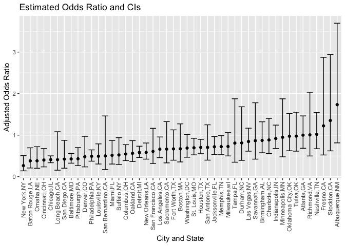
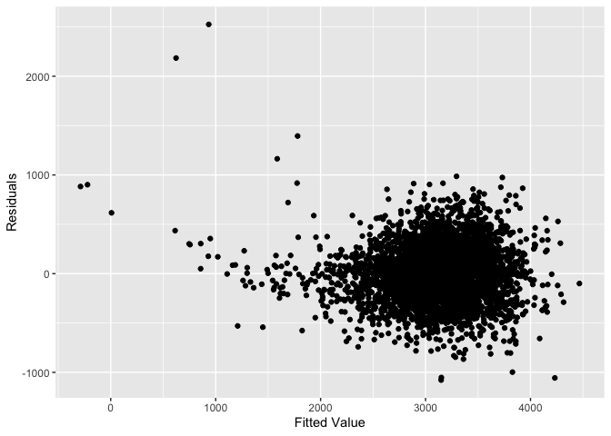
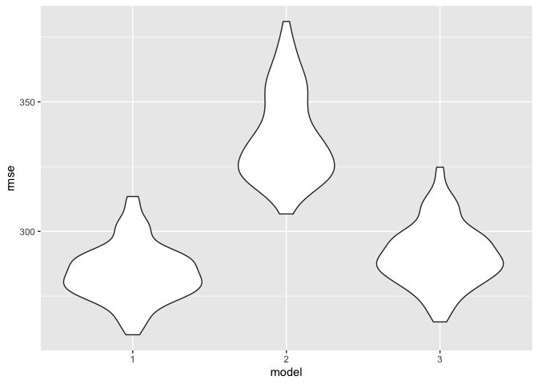

P8105_HW6
================
Meng Fang
2022-11-29

### Problem 2

``` r
homicide <- read_csv("./data/homicide-data.csv")
```

    ## Rows: 52179 Columns: 12
    ## ── Column specification ────────────────────────────────────────────────────────
    ## Delimiter: ","
    ## chr (9): uid, victim_last, victim_first, victim_race, victim_age, victim_sex...
    ## dbl (3): reported_date, lat, lon
    ## 
    ## ℹ Use `spec()` to retrieve the full column specification for this data.
    ## ℹ Specify the column types or set `show_col_types = FALSE` to quiet this message.

Clean Data: Create `city_state` variable and a binary variable
indicating whether the homicide is solved. Omit cities Dallas, TX;
Phoenix, AZ; and Kansas City, MO. Also omit Tulsa, AL.

``` r
homicide <- homicide %>%
  mutate(city_state = str_c(city,",",state),
         status = case_when(
           disposition == "Closed without arrest" ~ 0,
           disposition == "Open/No arrest" ~ 0,
           disposition == "Closed by arrest" ~ 1
         ),
         victim_age = as.numeric(victim_age)
         )%>%
  filter(city_state != "Dallas,TX",
         city_state != "Phoenix,AZ",
         city_state != "Kansas City,MO",
         city_state != "Tulsa,AL",
         victim_race %in% c("White","Black")) %>% drop_na()
```

    ## Warning in mask$eval_all_mutate(quo): NAs introduced by coercion

For the city of Baltimore, MD, use the glm function to fit a logistic
regression with resolved vs unresolved as the outcome and victim age,
sex and race as predictors. Save the output of glm as an R object; apply
the broom::tidy to this object; and obtain the estimate and confidence
interval of the adjusted odds ratio for solving homicides comparing male
victims to female victims keeping all other variables fixed.

``` r
Baltimore_df <- homicide %>% filter(city_state == "Baltimore,MD")
status_glm <- glm(status ~ victim_age + victim_race + victim_sex, data = Baltimore_df, family = "binomial")
status_glm %>%
  broom::tidy() %>%
  mutate(
    OR = exp(estimate),
    conf.low = exp(estimate - 1.96 * std.error),
    conf.high = exp(estimate + 1.96 * std.error)
  ) %>%
  filter(term == "victim_sexMale") %>%
  select(term, OR, conf.low, conf.high) %>%
  knitr::kable(digit = 3)
```

| term           |    OR | conf.low | conf.high |
|:---------------|------:|---------:|----------:|
| victim_sexMale | 0.426 |    0.325 |     0.558 |

Now we Run glm for each city. First we write a function to get
everything we need (OR, confidence interval bounds)

``` r
glm_fun <- function(x){
  
  city_glm <- glm(status ~ victim_age + victim_race + victim_sex, data = x, family = "binomial")
  
  result <- city_glm %>%
    broom::tidy() %>%
    mutate(
    OR = exp(estimate),
    conf.low = exp(estimate - 1.96 * std.error),
    conf.high = exp(estimate + 1.96 * std.error)
  ) %>%
    filter(term == "victim_sexMale") %>%
    select(OR, conf.low, conf.high) %>% mutate(across(is.numeric, round, digit = 3))
  
  result 
}
```

Them we run `glm` through each city using the function we created

``` r
result_df <- homicide %>%
  select(city_state, status, victim_age, victim_race, victim_sex) %>%
  nest(status:victim_sex) %>%
  mutate(result = map(data, glm_fun)) %>%
  select(-data) %>%
  unnest(result)
```

    ## Warning: All elements of `...` must be named.
    ## Did you want `data = status:victim_sex`?

    ## Warning: Use of bare predicate functions was deprecated in tidyselect 1.1.0.
    ## ℹ Please use wrap predicates in `where()` instead.
    ##   # Was:
    ##   data %>% select(is.numeric)
    ## 
    ##   # Now:
    ##   data %>% select(where(is.numeric))

``` r
result_df
```

    ## # A tibble: 47 × 4
    ##    city_state        OR conf.low conf.high
    ##    <chr>          <dbl>    <dbl>     <dbl>
    ##  1 Albuquerque,NM 1.73     0.814     3.70 
    ##  2 Atlanta,GA     1        0.684     1.46 
    ##  3 Baltimore,MD   0.426    0.325     0.558
    ##  4 Baton Rouge,LA 0.381    0.209     0.695
    ##  5 Birmingham,AL  0.873    0.576     1.32 
    ##  6 Boston,MA      0.672    0.355     1.27 
    ##  7 Buffalo,NY     0.522    0.291     0.939
    ##  8 Charlotte,NC   0.884    0.557     1.40 
    ##  9 Chicago,IL     0.41     0.336     0.501
    ## 10 Cincinnati,OH  0.4      0.236     0.677
    ## # … with 37 more rows

Finally, draw a plot of the CIs and ORs for each city

``` r
result_df %>%
  ggplot(aes(x = reorder(city_state, OR), y = OR)) +
  geom_point() +
  geom_errorbar(aes(ymin = conf.low, ymax = conf.high)) +
  theme(axis.text.x = element_text(angle = 90, vjust = 0.5, hjust = 1)) +
  xlab("City and State") +
  ylab("Adjusted Odds Ratio") +
  ggtitle("Estimated Odds Ratio and CIs")
```

<!-- -->

In this case a high OR indicates that homicide cases of male are more
likely to be solved than those cases of female, and vice versa. On this
case Albuquerque,NM has the highest OR meaning the that homicide cases
of male are more likely to be solved than those cases of female. On the
other hand, New York NY has the lowest OR, which means that that
homicide cases of female are more likely to be solved than those cases
of male.

### Problem 3

Load Data and Package

``` r
birthwt <- read_csv("./data/birthweight.csv")
```

    ## Rows: 4342 Columns: 20
    ## ── Column specification ────────────────────────────────────────────────────────
    ## Delimiter: ","
    ## dbl (20): babysex, bhead, blength, bwt, delwt, fincome, frace, gaweeks, malf...
    ## 
    ## ℹ Use `spec()` to retrieve the full column specification for this data.
    ## ℹ Specify the column types or set `show_col_types = FALSE` to quiet this message.

Clean Dataset

``` r
birthwt <- birthwt %>%
  mutate(
    babysex = factor(babysex, levels = c(1,2), labels = c("male","female")),
    frace = factor(frace, levels = c(1,2,3,4,8,9), labels = c("white","black","asian","puerto rican","other","unknown")),
    malform = factor(malform, levels = c(0,1), labels = c("absent","present")),
    mrace = factor(mrace, levels = c(1,2,3,4,8), labels = c("white","black","asian","puerto rican","other"))
  ) %>%
  drop_na()
```

Propose a model: I think that potential useful variables that can
predict the child birth weight are: baby’s head circumference at birth,
baby’s length at birth, mother’s weight at delivery, gestational age in
weeks, mother’s weight gain during pregnancy (pounds), these are
biological factors of the mom and the baby that might influence the
birthweight.

``` r
model_1 <- lm(bwt ~ bhead + blength + delwt + gaweeks + wtgain, data = birthwt)
summary(model_1)
```

    ## 
    ## Call:
    ## lm(formula = bwt ~ bhead + blength + delwt + gaweeks + wtgain, 
    ##     data = birthwt)
    ## 
    ## Residuals:
    ##      Min       1Q   Median       3Q      Max 
    ## -1078.44  -187.84    -7.21   175.83  2525.11 
    ## 
    ## Coefficients:
    ##               Estimate Std. Error t value Pr(>|t|)    
    ## (Intercept) -6173.5561    96.3127 -64.099  < 2e-16 ***
    ## bhead         135.1991     3.4946  38.688  < 2e-16 ***
    ## blength        78.7008     2.0701  38.017  < 2e-16 ***
    ## delwt           1.6149     0.2164   7.464 1.01e-13 ***
    ## gaweeks        13.6911     1.4907   9.184  < 2e-16 ***
    ## wtgain          2.1786     0.4359   4.998 6.04e-07 ***
    ## ---
    ## Signif. codes:  0 '***' 0.001 '**' 0.01 '*' 0.05 '.' 0.1 ' ' 1
    ## 
    ## Residual standard error: 282 on 4336 degrees of freedom
    ## Multiple R-squared:  0.6972, Adjusted R-squared:  0.6968 
    ## F-statistic:  1996 on 5 and 4336 DF,  p-value: < 2.2e-16

We see that all the predictors are significant in this proposed model,
so the model is statistically valid. Now we show a residuals against
fitted value plot of `model_1`

``` r
birthwt %>%
  add_residuals(model_1) %>%
  add_predictions(model_1) %>%
  ggplot(aes(x = pred, y = resid)) +
  geom_point() +
  labs(
    x = "Fitted Value",
    y = "Residuals"
  )
```

<!-- -->

The fitted value vs residual plot has most of the points scattered
evenly around 0 in this case, which looks good to us. Then we Compare
the proposed model with other two model

``` r
cv_df <- crossv_mc(birthwt, 100) %>%
  mutate(train = map(train, as_tibble),
         test = map(test, as_tibble))

cv_df <- cv_df %>% mutate(
  model_1 = map(train, ~lm(bwt ~ bhead + blength + delwt + gaweeks + wtgain, data = .x)),
  model_2 = map(train, ~lm(bwt ~ blength + gaweeks, data = .x)),
  model_3 = map(train, ~lm(bwt ~ bhead + blength + babysex + bhead * blength + bhead * babysex + blength * babysex + bhead * blength * babysex, data = .x))
) %>%
  mutate(
    rmse_1 = map2_dbl(model_1, test, ~rmse(model = .x, data = .y)),
    rmse_2 = map2_dbl(model_2, test, ~rmse(model = .x, data = .y)),
    rmse_3 = map2_dbl(model_3, test, ~rmse(model = .x, data = .y))
  )
```

Finally, we plot the rmse for each model and compare the prediction
error.

``` r
cv_df %>%
  select(starts_with("rmse")) %>%
  pivot_longer(
    everything(),
    names_to = "model",
    values_to = "rmse",
    names_prefix = "rmse_"
  ) %>%
  mutate(model = fct_inorder(model)) %>%
  ggplot(aes(x = model, y = rmse)) + geom_violin()
```

<!-- -->

Base on these results, we can see that model 1 has the lowest prediction
error (rmse), model 3 has the second lowest prediction error, and model
2 has the highest prediction error. As a result, we conclude that our
proposed model is better than the other two model in predicting child
birthweight.
